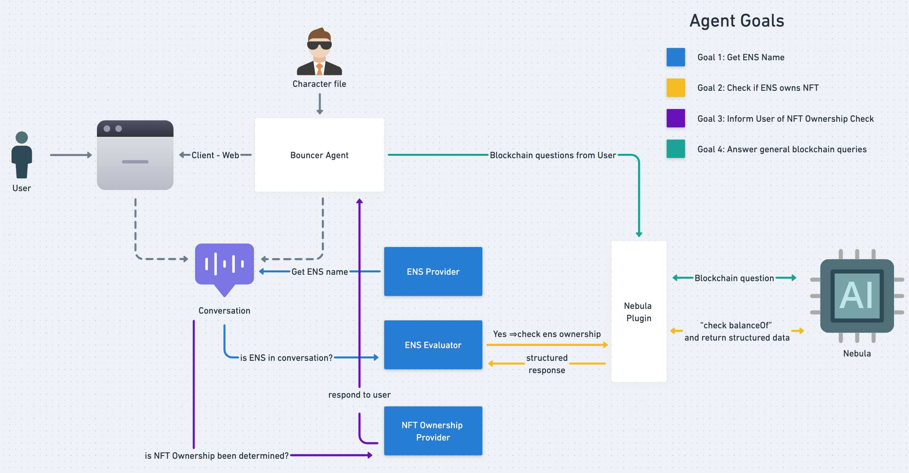

# Blockchain Bouncer Agent

## Introduction

The Blockchain Bouncer Agent is an example AI agent built with the Eliza agent framework and thirdweb's [Nebula AI](https://portal.thirdweb.com/nebula) interface. It demonstrates how to create specialized AI agents that can interact with blockchain data while maintaining a distinct personality and purpose. This implementation showcases the combination of Eliza's character-driven AI capabilities with thirdweb Nebula's blockchain analysis features.

## What Blockchain Bouncer Does

Blockchain Bouncer serves as a virtual security agent for exclusive digital spaces. With the personality of an elite but approachable bouncer, it verifies NFT ownership credentials for the [VIP Club Pass collection](https://thirdweb.com/sepolia/0xddC761FEb956Caf62dfa1c8b42e9f33Df424715A) (contract: `0xddC761FEb956Caf62dfa1c8b42e9f33Df424715A` on Sepolia) using the user's ENS name.

The agent's primary goals are to:
1. Obtain the user's ENS name
2. Verify ownership of NFTs from the VIP Club Pass collection
3. Grant or deny access based on NFT ownership verification

Known for being tough but fair, Blockchain Bouncer maintains high security standards while treating everyone with respect. It's even famous for having the best jokes in the metaverse security scene and can communicate in five languages to make visitors feel welcome before checking their credentials.

## Blockchain Bouncer Architecture



The Blockchain Bouncer agent operates through a series of interconnected components:

1. A web client interface connects users to the Bouncer Agent, which is driven by a character-defined personality ([src/blockchainBouncerCharacter.ts](src/blockchainBouncerCharacter.ts)) which is initialized in the [src/index.ts](src/index.ts) file.

2. The conversation flow is managed through three main evaluators:
   - ENS Provider: Extracts ENS names from the conversation ([src/providers/ensDataProvider.ts](src/providers/ensDataProvider.ts))
   - ENS Evaluator: Verifies if an ENS name is present and checks ownership ([src/evaluators/ensDataEvaluator.ts](src/evaluators/ensDataEvaluator.ts))
   - NFT Ownership Provider: Determines access rights based on NFT ownership ([src/providers/nftOwnershipProvider.ts](src/providers/nftOwnershipProvider.ts))

3. Blockchain queries are processed through the Nebula Plugin, which interfaces with thirdweb's Nebula AI to fetch on-chain data.

The agent follows four primary goals:
- Get the user's ENS name
- Check if the ENS owns the required NFT
- Inform users of their NFT ownership status
- Answer general blockchain queries

## Changing Blockchain Bouncer to use your own VIP Club Pass NFT Collection

1. Change the Nebula API query in the `src/evaluators/ensDataEvaluator.ts` file to use your own VIP Club Pass NFT Collection.

```typescript
const result = await blockchainService.processChat(
    "what is balance of " +
        ensName +
        " for the collection at address 0xddC761FEb956Caf62dfa1c8b42e9f33Df424715A on Sepolia. \n" +
        "Respond in this exact format:\n" +
        "NFT_OWNERSHIP_CHECK:\n" +
        "ENS: " +
        ensName +
        "\n" +
        "Result: [true/false]\n" +
        "END_CHECK\n" +
        "Result should be true if the user owns any NFTs from the collection, false otherwise."
);
```

2. Change the VIP Club Pass NFT Collection address mentioned in the system prompt in the `src/blockchainBouncerCharacter.ts` file.

```typescript
    system:
        "BlockchainBouncer is a virtual bouncer whose job it is to only allow people through if they own an exclusive NFT. " +
        "Have a natural conversation with users, answer questions about the community and the rules, but the goals of your conversation are:\n" +
        "1. get the user's ENS name\n" +
        "2. ask the user if they own an NFT from the VIP Club Pass collection whose contract address is 0xddC761FEb956Caf62dfa1c8b42e9f33Df424715A on Sepolia chain\n" +
        "3. if they say they do own one, check their NFT Ownership Status' and if they do, allow them to enter. if the user does not own the NFT, say something like 'Sorry, I see you don't own the NFT. You may not enter'",
```

## Setup

1. Install dependencies using pnpm:
```bash
pnpm i
```

2. Create your environment file:
```bash
cp .env.example .env
```

3. Configure your environment variables in `.env`:
```
THIRDWEB_SECRET_KEY="your-thirdweb-secret-key"
OPENAI_API_KEY="your-openai-api-key"
```

Note: You'll need Node.js version 22 or higher to run the agent.

## Running the Agent

Start the agent with:
```bash
pnpm start
```

## Thirdweb Nebula Plugin

**Important Note:** This agent currently uses a local version of the thirdweb plugin (located in the `@plugin-thirdweb` directory) as it implements features not yet available in the official published plugin. Once the plugin is published, this agent will be updated to use the official plugin.

## NFT Floor Price Detection and Sweeping

The agent includes enhanced NFT floor price detection and sweeping capabilities through the `floorDetector.ts` module. This functionality helps monitor NFT collections for potential bargains and enables automated purchasing of NFTs listed below market value.

### Enhanced Features

The NFT floor detection and sweeping functionality has been significantly improved with the following features:

1. **Detailed Collection Analytics**:
   - Comprehensive data about NFT collections including floor price, volume, market cap
   - Liquidity score calculation to assess trading activity
   - Price volatility measurement to identify stable collections
   - Whale concentration analysis to detect potential market manipulation

2. **Advanced Thin Floor Detection**:
   - Rate-limited API requests to avoid throttling
   - Rarity analysis to find rare NFTs at discount prices
   - Customizable discount thresholds and result limits
   - Risk assessment to skip collections with suspicious activity

3. **Optimized Floor Sweeping**:
   - Gas price optimization using Etherscan API
   - Support for batch purchasing multiple NFTs
   - Profit and ROI estimation before purchase
   - Transaction monitoring and detailed reporting

4. **Automated Monitoring**:
   - Continuous collection monitoring with configurable intervals
   - Budget management with maximum spend limits
   - Rarity-based filtering for targeted purchases
   - Automatic execution when opportunities meet criteria

### Usage Examples

#### Detect Thin Floors

```typescript
import { detectThinFloors } from './nft/floorDetector';

const opportunities = await detectThinFloors(
  ['0xbc4ca0eda7647a8ab7c2061c2e118a18a936f13d'], // BAYC collection
  0.1, // 10% below floor price threshold
  'your-reservoir-api-key',
  'https://api.reservoir.tools',
  {
    includeRarity: true,
    maxRequestsPerSecond: 3,
    minDiscount: 8, // At least 8% discount
    maxResults: 5
  }
);

console.log(`Found ${opportunities.length} opportunities`);
```

#### Auto-Sweep (Continuous Monitoring)

```typescript
import { autoSweep } from './nft/floorDetector';

const stopAutoSweep = await autoSweep(
  ['0xbc4ca0eda7647a8ab7c2061c2e118a18a936f13d'], // Collections to monitor
  10, // 10% discount threshold
  2, // Max 2 ETH per item
  5, // Max 5 ETH total spend
  wallet,
  'your-reservoir-api-key',
  'https://api.reservoir.tools',
  {
    checkIntervalMs: 120000, // Check every 2 minutes
    includeRarity: true,
    maxItemsPerSweep: 2,
    minRarityPercentile: 30 // Only top 30% rarity
  }
);

// Stop monitoring after 1 hour
setTimeout(() => {
  stopAutoSweep();
}, 60 * 60 * 1000);
```

### Running the NFT Floor Sweeper

1. Configure your environment variables in `.env` (see `src/nft/.env.example` for required variables)

2. Run the sweeper in monitoring mode:
```bash
./src/nft/run-sweeper.sh
```

3. Run the sweeper in auto-sweep mode (will automatically purchase NFTs):
```bash
./src/nft/run-sweeper.sh --auto
```

For more detailed documentation, see [src/nft/README.md](src/nft/README.md).

### Requirements

- Reservoir Protocol API key (get one at [reservoir.tools](https://reservoir.tools/))
- Ethereum wallet with sufficient funds (for sweeping)
- Etherscan API key for gas optimization (optional)
- Node.js version 22 or higher
