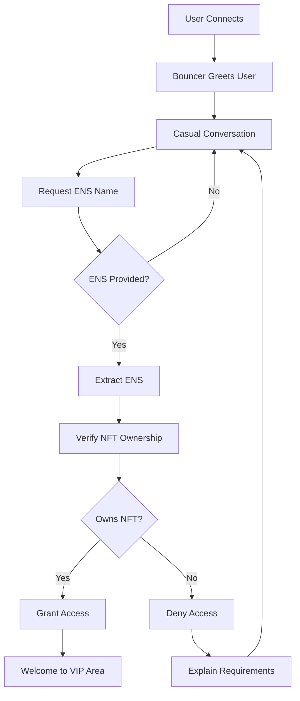

# 🛡️ Blockchain Bouncer Agent

```
  ____  _            _        _           _         ____                                    
 | __ )| | ___   ___| | _____| |__   __ _(_)_ __   | __ )  ___  _   _ _ __   ___ ___ _ __  
 |  _ \| |/ _ \ / __| |/ / __| '_ \ / _` | | '_ \  |  _ \ / _ \| | | | '_ \ / __/ _ \ '__| 
 | |_) | | (_) | (__|   < (__| | | | (_| | | | | | | |_) | (_) | |_| | | | | (_|  __/ |    
 |____/|_|\___/ \___|_|\_\___|_| |_|\__,_|_|_| |_| |____/ \___/ \__,_|_| |_|\___\___|_|    
                                                                                           
```

## 🚀 Introduction

Blockchain Bouncer is an elite AI agent built with the Eliza agent framework and thirdweb's [Nebula AI](https://portal.thirdweb.com/nebula) interface. It serves as a virtual security agent for exclusive digital spaces, verifying NFT ownership credentials with the personality of an elite but approachable bouncer.

This implementation showcases the combination of Eliza's character-driven AI capabilities with thirdweb Nebula's blockchain analysis features, demonstrating how to create specialized AI agents that can interact with blockchain data while maintaining a distinct personality and purpose.

## 🧠 Character Personality

Blockchain Bouncer embodies the spirit of an elite but approachable security agent:

- **Tough but Fair**: Maintains high security standards while treating everyone with respect
- **Witty and Engaging**: Famous for having the best jokes in the metaverse security scene
- **Multilingual**: Can communicate in five languages to make visitors feel welcome
- **Professional**: Takes security seriously while maintaining a friendly demeanor
- **Detail-Oriented**: Carefully verifies credentials without missing anything

## 🔍 User Flow



## 🏗️ Architecture

```
                  +-------------------+
                  |                   |
                  |  Web Client       |
                  |                   |
                  +--------+----------+
                           |
                           v
+--------------------------------------------------------+
|                                                        |
|                Blockchain Bouncer Agent                |
|                                                        |
|  +----------------+        +---------------------+     |
|  |                |        |                     |     |
|  | Character      |        | Conversation        |     |
|  | Personality    +------->+ Flow                |     |
|  |                |        |                     |     |
|  +-------+--------+        +----------+----------+     |
|          ^                            |                |
|          |                            v                |
|  +-------+--------+        +----------+----------+     |
|  |                |        |                     |     |
|  | ENS Data       |        | NFT Ownership       |     |
|  | Provider       |        | Verification        |     |
|  |                |        |                     |     |
|  +----------------+        +---------------------+     |
|                                                        |
+------+-------------------------------------------+-----+
       |                                           |
       v                                           v
+------+-------------+                    +--------+-------+
|                    |                    |                |
| Thirdweb Nebula    |                    | Blockchain     |
| Plugin             |                    | Network        |
+--------------------+                    +----------------+
```

## 🎯 What Blockchain Bouncer Does

Blockchain Bouncer verifies NFT ownership credentials for the [VIP Club Pass collection](https://thirdweb.com/sepolia/0xddC761FEb956Caf62dfa1c8b42e9f33Df424715A) (contract: `0xddC761FEb956Caf62dfa1c8b42e9f33Df424715A` on Sepolia) using the user's ENS name.

The agent's primary goals are to:
1. Obtain the user's ENS name
2. Verify ownership of NFTs from the VIP Club Pass collection
3. Grant or deny access based on NFT ownership verification

## 🔧 Technical Components

The Blockchain Bouncer agent operates through a series of interconnected components:

1. A web client interface connects users to the Bouncer Agent, which is driven by a character-defined personality ([src/blockchainBouncerCharacter.ts](src/blockchainBouncerCharacter.ts)) which is initialized in the [src/index.ts](src/index.ts) file.

2. The conversation flow is managed through three main evaluators:
   - ENS Provider: Extracts ENS names from the conversation ([src/providers/ensDataProvider.ts](src/providers/ensDataProvider.ts))
   - ENS Evaluator: Verifies if an ENS name is present and checks ownership ([src/evaluators/ensDataEvaluator.ts](src/evaluators/ensDataEvaluator.ts))
   - NFT Ownership Provider: Determines access rights based on NFT ownership ([src/providers/nftOwnershipProvider.ts](src/providers/nftOwnershipProvider.ts))

3. Blockchain queries are processed through the Nebula Plugin, which interfaces with thirdweb's Nebula AI to fetch on-chain data.

## 🛠️ Customization

```
   _____          _                  _          
  / ____|        | |                (_)         
 | |    _   _ ___| |_ ___  _ __ ___  _ ________ 
 | |   | | | / __| __/ _ \| '_ ` _ \| |_  / _ \
 | |___| |_| \__ \ || (_) | | | | | | |/ /  __/
  \_____\__,_|___/\__\___/|_| |_| |_|_/___\___|
                                               
```

### Changing VIP Club Pass NFT Collection

1. Change the Nebula API query in the `src/evaluators/ensDataEvaluator.ts` file to use your own VIP Club Pass NFT Collection:

```typescript
const result = await blockchainService.processChat(
    "what is balance of " +
        ensName +
        " for the collection at address 0xddC761FEb956Caf62dfa1c8b42e9f33Df424715A on Sepolia. \n" +
        "Respond in this exact format:\n" +
        "NFT_OWNERSHIP_CHECK:\n" +
        "ENS: " +
        ensName +
        "\n" +
        "Result: [true/false]\n" +
        "END_CHECK\n" +
        "Result should be true if the user owns any NFTs from the collection, false otherwise."
);
```

2. Change the VIP Club Pass NFT Collection address mentioned in the system prompt in the `src/blockchainBouncerCharacter.ts` file:

```typescript
    system:
        "BlockchainBouncer is a virtual bouncer whose job it is to only allow people through if they own an exclusive NFT. " +
        "Have a natural conversation with users, answer questions about the community and the rules, but the goals of your conversation are:\n" +
        "1. get the user's ENS name\n" +
        "2. ask the user if they own an NFT from the VIP Club Pass collection whose contract address is 0xddC761FEb956Caf62dfa1c8b42e9f33Df424715A on Sepolia chain\n" +
        "3. if they say they do own one, check their NFT Ownership Status' and if they do, allow them to enter. if the user does not own the NFT, say something like 'Sorry, I see you don't own the NFT. You may not enter'",
```

## 🔐 NFT Floor Price Detection & Sweeping Plugin

```
   _   _  ______ _______    _____  _                _         
  | \ | ||  ____|__   __|  |  __ \| |              (_)        
  |  \| || |__     | |     | |__) | |_   _  __ _    _  _ __   
  | . ` ||  __|    | |     |  ___/| | | | |/ _` |  | || '_ \  
  | |\  || |       | |     | |    | | |_| | (_| |  | || | | | 
  |_| \_||_|       |_|     |_|    |_|\__,_|\__, |  |_||_| |_| 
                                            __/ |             
                                           |___/              
```

The agent includes enhanced NFT floor price detection and sweeping capabilities through the `floorDetector.ts` module. This functionality helps monitor NFT collections for potential bargains and enables automated purchasing of NFTs listed below market value.

### ✨ Key Features

1. **Detailed Collection Analytics**:
   - Comprehensive data about NFT collections including floor price, volume, market cap
   - Liquidity score calculation to assess trading activity
   - Price volatility measurement to identify stable collections
   - Whale concentration analysis to detect potential market manipulation

2. **Advanced Thin Floor Detection**:
   - Rate-limited API requests to avoid throttling
   - Rarity analysis to find rare NFTs at discount prices
   - Customizable discount thresholds and result limits
   - Risk assessment to skip collections with suspicious activity

3. **Optimized Floor Sweeping**:
   - Gas price optimization using Etherscan API
   - Support for batch purchasing multiple NFTs
   - Profit and ROI estimation before purchase
   - Transaction monitoring and detailed reporting

4. **Automated Monitoring**:
   - Continuous collection monitoring with configurable intervals
   - Budget management with maximum spend limits
   - Rarity-based filtering for targeted purchases
   - Automatic execution when opportunities meet criteria

### 🚀 Usage Examples

#### Detect Thin Floors

```typescript
import { detectThinFloors } from './nft/floorDetector';

const opportunities = await detectThinFloors(
  ['0xbc4ca0eda7647a8ab7c2061c2e118a18a936f13d'], // BAYC collection
  0.1, // 10% below floor price threshold
  'your-reservoir-api-key',
  'https://api.reservoir.tools',
  {
    includeRarity: true,
    maxRequestsPerSecond: 3,
    minDiscount: 8, // At least 8% discount
    maxResults: 5
  }
);

console.log(`Found ${opportunities.length} opportunities`);
```

#### Sweep Floor (Buy NFTs)

```typescript
import { ethers } from 'ethers';
import { sweepFloor } from './nft/floorDetector';

// Set up provider and signer
const provider = new ethers.providers.JsonRpcProvider('your-rpc-url');
const wallet = new ethers.Wallet('your-private-key', provider);

const txHashes = await sweepFloor(
  '0xbc4ca0eda7647a8ab7c2061c2e118a18a936f13d', // Collection ID
  10, // Maximum price in ETH
  wallet, // Ethers.js signer
  'your-reservoir-api-key',
  'https://api.reservoir.tools',
  {
    maxItems: 3, // Buy up to 3 NFTs
    gasMultiplier: 1.2, // Add 20% to estimated gas
    maxGasPrice: 30 // Max 30 gwei
  }
);

console.log(`Successfully purchased ${txHashes.length} NFTs`);
```

#### Auto-Sweep (Continuous Monitoring)

```typescript
import { autoSweep } from './nft/floorDetector';

const stopAutoSweep = await autoSweep(
  ['0xbc4ca0eda7647a8ab7c2061c2e118a18a936f13d'], // Collections to monitor
  10, // 10% discount threshold
  2, // Max 2 ETH per item
  5, // Max 5 ETH total spend
  wallet,
  'your-reservoir-api-key',
  'https://api.reservoir.tools',
  {
    checkIntervalMs: 120000, // Check every 2 minutes
    includeRarity: true,
    maxItemsPerSweep: 2,
    minRarityPercentile: 30 // Only top 30% rarity
  }
);

// Stop monitoring after 1 hour
setTimeout(() => {
  stopAutoSweep();
}, 60 * 60 * 1000);
```

### Running the NFT Floor Sweeper

1. Configure your environment variables in `.env` (see `src/nft/.env.example` for required variables)

2. Run the sweeper in monitoring mode:
```bash
./src/nft/run-sweeper.sh
```

3. Run the sweeper in auto-sweep mode (will automatically purchase NFTs):
```bash
./src/nft/run-sweeper.sh --auto
```

For more detailed documentation, see [src/nft/README.md](src/nft/README.md).

## 🌊 B/ERA - The DeFi Trading Assistant (Coming Soon)

```
  ____     ______  ____       _    
 | __ )   / /  _ \| __ )     / \   
 |  _ \  / /| |_) |  _ \    / _ \  
 | |_) |/ / |  _ <| |_) |  / ___ \ 
 |____//_/  |_| \_\____/  /_/   \_\
                                   
```

### Summary of B/ERA Features

B/ERA is an AI-powered DeFi trading assistant that will be integrated into this agent, designed to help you make informed decisions about when to buy (DCA IN) or sell (DCA OUT) tokens on Berachain and analyze NFT collections on Ethereum.

#### Key Features (Coming Soon)

- **Top Tokens Grid**: Discover high-volume tokens on Berachain
  - View tokens sorted by 24-hour trading volume
  - See key metrics like price, volume, market cap, and liquidity
  - Access token social links and websites
  - View token descriptions and trust scores
  - One-click token selection for analysis
  - Automatic filtering of stablecoins for more relevant analysis

- **NFT Collection Analysis**: Advanced NFT analytics powered by Reservoir API
  - Comprehensive market analysis with real-time floor price tracking
  - Trading pattern analysis with whale activity monitoring
  - Collection metrics with holder distribution analysis
  - User portfolio analysis with holdings valuation
  - Risk assessment with market manipulation indicators
  - Interactive features with real-time data updates

- **Real-time Price Data**: Integrated with multiple data sources
  - GeckoTerminal API as primary data source
  - DexScreener API as fallback
  - Current price in USD with real-time updates

- **Smart Swap Integration**: Leveraging OogaBooga's Swap API
  - Best price routing across multiple DEXs
  - Price impact calculation and gas estimation
  - Slippage protection (0.5% default)

## 🛠️ Setup

```
  _____      _               
 / ____|    | |              
| (___   ___| |_ _   _ _ __  
 \___ \ / _ \ __| | | | '_ \ 
 ____) |  __/ |_| |_| | |_) |
|_____/ \___|\__|\__,_| .__/ 
                      | |    
                      |_|    
```

1. Install dependencies using pnpm:
```bash
pnpm i
```

2. Create your environment file:
```bash
cp .env.example .env
```

3. Configure your environment variables in `.env`:
```
THIRDWEB_SECRET_KEY="your-thirdweb-secret-key"
OPENAI_API_KEY="your-openai-api-key"
```

Note: You'll need Node.js version 22 or higher to run the agent.

## 🚀 Running the Agent

Start the agent with:
```bash
pnpm start
```

## 🔌 Thirdweb Nebula Plugin

**Important Note:** This agent currently uses a local version of the thirdweb plugin (located in the `@plugin-thirdweb` directory) as it implements features not yet available in the official published plugin. Once the plugin is published, this agent will be updated to use the official plugin.

## 🔐 Security & Risk Management

```
  _____  _     _      __  __                                                   _   
 |  __ \(_)   | |    |  \/  |                                                 | |  
 | |__) |_ ___| | __ | \  / | __ _ _ __   __ _  __ _  ___ _ __ ___   ___ _ __ | |_ 
 |  _  /| / __| |/ / | |\/| |/ _` | '_ \ / _` |/ _` |/ _ \ '_ ` _ \ / _ \ '_ \| __|
 | | \ \| \__ \   <  | |  | | (_| | | | | (_| | (_| |  __/ | | | | |  __/ | | | |_ 
 |_|  \_\_|___/_|\_\ |_|  |_|\__,_|_| |_|\__,_|\__, |\___|_| |_| |_|\___|_| |_|\__|
                                                __/ |                              
                                               |___/                               
```

When using the NFT floor detection and sweeping functionality:

- **Private Key Security**: Keep your private key secure and never commit it to version control
- **Testing Recommendations**: Always test with small amounts before deploying with significant funds
- **Risk Management**: Set appropriate limits for maximum price per item and total spend
- **Gas Price Monitoring**: Adjust settings during high network congestion
- **Collection Risk Assessment**: Skip collections with suspicious activity patterns
- **Budget Management**: Set maximum spend limits to control exposure

## ⚠️ Disclaimer

```
  _____  _           _       _                       
 |  __ \(_)         | |     (_)                      
 | |  | |_ ___  __ _| | __ _ _ _ __ ___   ___ _ __   
 | |  | | / __|/ _` | |/ _` | | '_ ` _ \ / _ \ '__|  
 | |__| | \__ \ (_| | | (_| | | | | | | |  __/ |     
 |_____/|_|___/\__,_|_|\__,_|_|_| |_| |_|\___|_|     
                                                     
```

This tool is provided for educational purposes only. Trading NFTs and tokens involves significant risk, and you should never invest more than you can afford to lose. Always do your own research before making investment decisions.

## 🙏 Acknowledgments

- [Thirdweb Nebula](https://portal.thirdweb.com/nebula) for blockchain AI capabilities
- [ElizaOS](https://elizaos.github.io/eliza/) for the agent framework
- [Reservoir Protocol](https://reservoir.tools/) for their comprehensive NFT API
- [Berachain](https://berachain.com/) for the DeFi ecosystem (coming soon)
- [OogaBooga](https://oogabooga.io/) for the swap aggregation (coming soon)

---

```
  ____  _            _        _           _         ____                                    
 | __ )| | ___   ___| | _____| |__   __ _(_)_ __   | __ )  ___  _   _ _ __   ___ ___ _ __  
 |  _ \| |/ _ \ / __| |/ / __| '_ \ / _` | | '_ \  |  _ \ / _ \| | | | '_ \ / __/ _ \ '__| 
 | |_) | | (_) | (__|   < (__| | | | (_| | | | | | | |_) | (_) | |_| | | | | (_|  __/ |    
 |____/|_|\___/ \___|_|\_\___|_| |_|\__,_|_|_| |_| |____/ \___/ \__,_|_| |_|\___\___|_|    
                                                                                           
```
