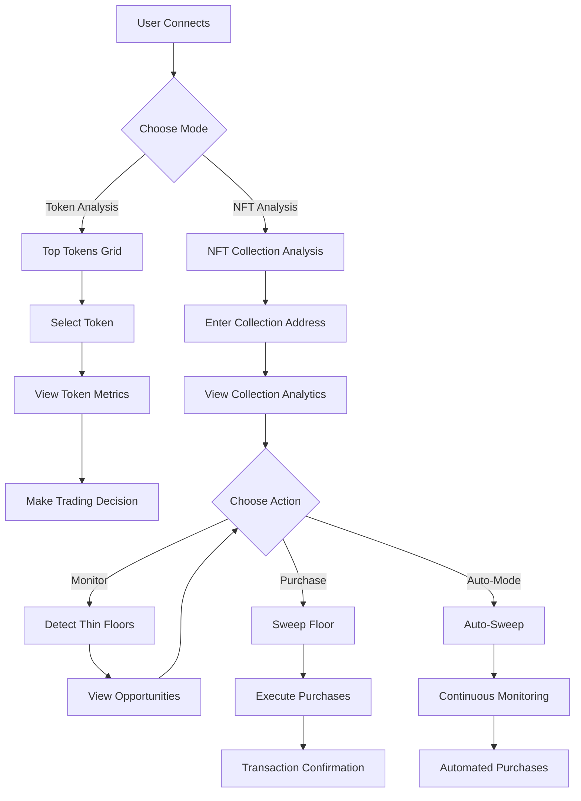

# 🌊 B/ERA - The DeFi Trading Assistant

```
  ____     ______  ____       _    
 | __ )   / /  _ \| __ )     / \   
 |  _ \  / /| |_) |  _ \    / _ \  
 | |_) |/ / |  _ <| |_) |  / ___ \ 
 |____//_/  |_| \_\____/  /_/   \_\
                                   
```

## 🚀 Introduction

B/ERA is your AI-powered DeFi trading assistant, designed to help you make informed decisions about when to buy (DCA IN) or sell (DCA OUT) tokens on Berachain and analyze NFT collections on Ethereum. With a personality that combines analytical precision with friendly guidance, B/ERA helps you navigate the complex world of DeFi and NFTs.

B/ERA specializes in finding hidden gems on the NFT floor through advanced floor price detection and sweeping capabilities, leveraging the Reservoir API to identify and capitalize on market inefficiencies.

## 🧠 Character Personality

B/ERA embodies the spirit of a knowledgeable yet approachable trading assistant:

- **Analytical but Accessible**: Breaks down complex market data into actionable insights
- **Patient Educator**: Takes time to explain concepts to users of all experience levels
- **Risk-Conscious**: Always emphasizes proper risk management and due diligence
- **Market-Savvy**: Stays on top of trends while avoiding hype-driven recommendations
- **Transparent**: Clearly communicates the reasoning behind all recommendations

## 🔍 User Flow



## 💎 NFT Floor Price Detection & Sweeping Plugin

```
   _   _  ______ _______    _____  _                _         
  | \ | ||  ____|__   __|  |  __ \| |              (_)        
  |  \| || |__     | |     | |__) | |_   _  __ _    _  _ __   
  | . ` ||  __|    | |     |  ___/| | | | |/ _` |  | || '_ \  
  | |\  || |       | |     | |    | | |_| | (_| |  | || | | | 
  |_| \_||_|       |_|     |_|    |_|\__,_|\__, |  |_||_| |_| 
                                            __/ |             
                                           |___/              
```

Our NFT plugin is a powerful ElizaOS-compatible module that helps you discover, analyze, and automatically purchase undervalued NFTs from collections you care about. It's designed to identify "thin floors" - NFTs listed significantly below the collection's floor price - and can automatically purchase them when they meet your criteria.

### ✨ Key Features

- **Detailed Collection Analytics**: Comprehensive data about NFT collections including floor price, volume, market cap, liquidity score, price volatility, and whale concentration
  
- **Thin Floor Detection**: Find NFTs listed significantly below floor price with customizable discount thresholds
  
- **Rarity Analysis**: Include rarity data in opportunity detection to find rare NFTs at discount prices
  
- **Gas Optimization**: Automatically optimize gas prices and limits for efficient transactions
  
- **Batch Purchasing**: Support for buying multiple NFTs in a single operation
  
- **Auto-Sweeping**: Continuously monitor collections and automatically purchase NFTs when they meet specified criteria
  
- **Risk Assessment**: Skip collections with suspicious activity patterns like high volatility or whale concentration
  
- **Rate Limiting**: Built-in rate limiting to avoid API throttling when monitoring multiple collections

### 🔧 Technical Architecture

```
                  +-------------------+
                  |                   |
                  |  ElizaOS Agent    |
                  |                   |
                  +--------+----------+
                           |
                           v
+--------------------------------------------------------+
|                                                        |
|                    NFT Plugin                          |
|                                                        |
|  +----------------+        +---------------------+     |
|  |                |        |                     |     |
|  | Collection     |        | Floor Detection     |     |
|  | Analytics      +------->+ & Sweeping          |     |
|  |                |        |                     |     |
|  +-------+--------+        +----------+----------+     |
|          ^                            |                |
|          |                            v                |
|  +-------+--------+        +----------+----------+     |
|  |                |        |                     |     |
|  | Rarity         |        | Transaction         |     |
|  | Analysis       |        | Execution           |     |
|  |                |        |                     |     |
|  +----------------+        +---------------------+     |
|                                                        |
+------+-------------------------------------------+-----+
       |                                           |
       v                                           v
+------+-------------+                    +--------+-------+
|                    |                    |                |
| Reservoir API      |                    | Ethereum       |
|                    |                    | Network        |
+--------------------+                    +----------------+
```

### 🚀 Usage Examples

#### Detect Thin Floors

```typescript
import { detectThinFloors } from '@elizaos/plugin-nft';

const opportunities = await detectThinFloors(
  ['0xbc4ca0eda7647a8ab7c2061c2e118a18a936f13d'], // BAYC collection
  0.1, // 10% below floor price threshold
  'your-reservoir-api-key',
  'https://api.reservoir.tools',
  {
    includeRarity: true,
    maxRequestsPerSecond: 3,
    minDiscount: 8, // At least 8% discount
    maxResults: 5
  }
);

console.log(`Found ${opportunities.length} opportunities`);
```

#### Sweep Floor (Buy NFTs)

```typescript
import { ethers } from 'ethers';
import { sweepFloor } from '@elizaos/plugin-nft';

// Set up provider and signer
const provider = new ethers.providers.JsonRpcProvider('your-rpc-url');
const wallet = new ethers.Wallet('your-private-key', provider);

const txHashes = await sweepFloor(
  '0xbc4ca0eda7647a8ab7c2061c2e118a18a936f13d', // Collection ID
  10, // Maximum price in ETH
  wallet, // Ethers.js signer
  'your-reservoir-api-key',
  'https://api.reservoir.tools',
  {
    maxItems: 3, // Buy up to 3 NFTs
    gasMultiplier: 1.2, // Add 20% to estimated gas
    maxGasPrice: 30 // Max 30 gwei
  }
);

console.log(`Successfully purchased ${txHashes.length} NFTs`);
```

#### Auto-Sweep (Continuous Monitoring)

```typescript
import { ethers } from 'ethers';
import { autoSweep } from '@elizaos/plugin-nft';

// Set up provider and signer
const provider = new ethers.providers.JsonRpcProvider('your-rpc-url');
const wallet = new ethers.Wallet('your-private-key', provider);

const stopAutoSweep = await autoSweep(
  ['0xbc4ca0eda7647a8ab7c2061c2e118a18a936f13d'], // Collections to monitor
  10, // 10% discount threshold
  2, // Max 2 ETH per item
  5, // Max 5 ETH total spend
  wallet,
  'your-reservoir-api-key',
  'https://api.reservoir.tools',
  {
    checkIntervalMs: 120000, // Check every 2 minutes
    includeRarity: true,
    maxItemsPerSweep: 2,
    minRarityPercentile: 30 // Only top 30% rarity
  }
);

// Stop monitoring after 1 hour
setTimeout(() => {
  stopAutoSweep();
}, 60 * 60 * 1000);
```

## 📊 Token Analysis Features

```
  _______    _                   _____      _     _ 
 |__   __|  | |                 / ____|    (_)   | |
    | | ___ | | _____ _ __     | |  __ _ __ _  __| |
    | |/ _ \| |/ / _ \ '_ \    | | |_ | '__| |/ _` |
    | | (_) |   <  __/ | | |   | |__| | |  | | (_| |
    |_|\___/|_|\_\___|_| |_|    \_____|_|  |_|\__,_|
                                                    
```

B/ERA also provides comprehensive token analysis for Berachain:

- **Top Tokens Grid**: Discover high-volume tokens on Berachain
  - View tokens sorted by 24-hour trading volume
  - See key metrics like price, volume, market cap, and liquidity
  - Access token social links and websites
  - View token descriptions and trust scores
  - One-click token selection for analysis
  - Automatic filtering of stablecoins for more relevant analysis

- **Real-time Price Data**: Integrated with multiple data sources for accurate and up-to-date token information
  - GeckoTerminal API as primary data source
  - DexScreener API as fallback
  - Current price in USD
  - Price updates in real-time

- **Smart Swap Integration**: Leveraging OogaBooga's Swap API for efficient token swaps
  - Best price routing across multiple DEXs
  - Price impact calculation
  - Gas estimation
  - Slippage protection (0.5% default)

## 🛠️ Installation

```
  _____           _        _ _       _   _             
 |_   _|         | |      | | |     | | (_)            
   | |  _ __  ___| |_ __ _| | | __ _| |_ _  ___  _ __  
   | | | '_ \/ __| __/ _` | | |/ _` | __| |/ _ \| '_ \ 
  _| |_| | | \__ \ || (_| | | | (_| | |_| | (_) | | | |
 |_____|_| |_|___/\__\__,_|_|_|\__,_|\__|_|\___/|_| |_|
                                                       
```

1. Upload the plugin to your ElizaOS packages folder:

```
packages/
└─ plugin-nft/
   ├─ package.json
   ├─ tsconfig.json
   ├─ src/
   │  ├─ index.ts         # Main plugin entry
   │  ├─ actions/         # Custom actions
   │  │  └─ floorDetector.ts
   │  ├─ providers/       # Data providers
   │  │  └─ helpers.ts
   │  ├─ types.ts         # Type definitions
   │  └─ environment.ts   # Configuration
   ├─ README.md
   └─ LICENSE
```

2. Add the plugin to your project's dependencies in package.json:

```json
{
  "dependencies": {
    "@elizaos/plugin-nft": "workspace:*"
  }
}
```

3. Import the plugin in your agent's character.json:

```json
{
  "plugins": [
    "@elizaos/plugin-nft"
  ]
}
```

4. Configure your environment variables in `.env`:

```
RESERVOIR_API_KEY=your_reservoir_api_key
ETHERSCAN_API_KEY=your_etherscan_api_key
RPC_URL=your_ethereum_rpc_url
```

## 🔐 Security & Risk Management

```
  _____  _     _      __  __                                                   _   
 |  __ \(_)   | |    |  \/  |                                                 | |  
 | |__) |_ ___| | __ | \  / | __ _ _ __   __ _  __ _  ___ _ __ ___   ___ _ __ | |_ 
 |  _  /| / __| |/ / | |\/| |/ _` | '_ \ / _` |/ _` |/ _ \ '_ ` _ \ / _ \ '_ \| __|
 | | \ \| \__ \   <  | |  | | (_| | | | | (_| | (_| |  __/ | | | | |  __/ | | | |_ 
 |_|  \_\_|___/_|\_\ |_|  |_|\__,_|_| |_|\__,_|\__, |\___|_| |_| |_|\___|_| |_|\__|
                                                __/ |                              
                                               |___/                               
```

B/ERA takes security and risk management seriously:

- **Private Key Security**: Keep your private key secure and never commit it to version control
- **Testing Recommendations**: Always test with small amounts before deploying with significant funds
- **Risk Management**: Set appropriate limits for maximum price per item and total spend
- **Gas Price Monitoring**: Adjust settings during high network congestion
- **Collection Risk Assessment**: Skip collections with suspicious activity patterns
- **Budget Management**: Set maximum spend limits to control exposure

## 📝 API Reference

### NFT Plugin Functions

- `getCollectionAnalytics(collectionId, apiKey, apiBase)`: Gets detailed analytics for an NFT collection
- `getTokenRarity(collectionId, tokenId, apiKey, apiBase)`: Gets rarity data for a specific token
- `detectThinFloors(collectionIds, priceThreshold, apiKey, apiBase, options)`: Detects NFTs listed below floor price
- `sweepFloor(collectionId, maxPrice, signer, apiKey, apiBase, options)`: Buys NFTs below specified price
- `autoSweep(collectionIds, discountThreshold, maxPricePerItem, maxTotalSpend, signer, apiKey, apiBase, options)`: Continuously monitors and purchases NFTs

## ⚠️ Disclaimer

```
  _____  _           _       _                       
 |  __ \(_)         | |     (_)                      
 | |  | |_ ___  __ _| | __ _ _ _ __ ___   ___ _ __   
 | |  | | / __|/ _` | |/ _` | | '_ ` _ \ / _ \ '__|  
 | |__| | \__ \ (_| | | (_| | | | | | | |  __/ |     
 |_____/|_|___/\__,_|_|\__,_|_|_| |_| |_|\___|_|     
                                                     
```

This tool is provided for educational purposes only. Trading NFTs and tokens involves significant risk, and you should never invest more than you can afford to lose. Always do your own research before making investment decisions.

## 🙏 Acknowledgments

- [Reservoir Protocol](https://reservoir.tools/) for their comprehensive NFT API
- [ElizaOS](https://elizaos.github.io/eliza/) for the agent framework
- [Berachain](https://berachain.com/) for the DeFi ecosystem
- [OogaBooga](https://oogabooga.io/) for the swap aggregation

---

```
  ____                      _                 _   _                 
 |  _ \                    | |               | | | |                
 | |_) |_   _  _   _       | |__   ___ _ __ | |_| |_ ___ _ __      
 |  _ <| | | || | | |      | '_ \ / _ \ '_ \| __| __/ _ \ '__|     
 | |_) | |_| || |_| |      | |_) |  __/ | | | |_| ||  __/ |        
 |____/ \__,_| \__, |      |_.__/ \___|_| |_|\__|\__\___|_|        
                __/ |                                               
               |___/                                                
```
