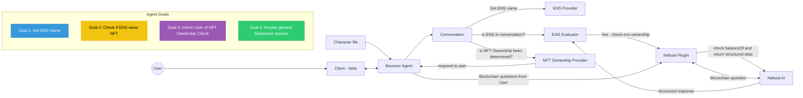

```mermaid
graph LR
    %% Main Components
    User((User))
    WebClient[Client - Web]
    Character[Character file]
    BouncerAgent[Bouncer Agent]
    Conversation[Conversation]
    ENSProvider[ENS Provider]
    ENSEvaluator[ENS Evaluator]
    NFTProvider[NFT Ownership Provider]
    NebulaPlugin[Nebula Plugin]
    Nebula[Nebula AI]

    %% Styling for Goals
    subgraph Goals[Agent Goals]
        Goal1[Goal 1: Get ENS Name]:::blue
        Goal2[Goal 2: Check if ENS owns NFT]:::yellow
        Goal3[Goal 3: Inform User of NFT Ownership Check]:::purple
        Goal4[Goal 4: Answer general blockchain queries]:::green
    end

    %% Main Flow
    User --> WebClient
    Character --> BouncerAgent
    WebClient <--> BouncerAgent
    BouncerAgent --> Conversation
    
    %% ENS Flow
    Conversation -->|Get ENS name| ENSProvider
    Conversation -->|is ENS in conversation?| ENSEvaluator
    ENSEvaluator -->|Yes - check ens ownership| NebulaPlugin
    NebulaPlugin -->|"check balanceOf" and return structured data| Nebula
    Nebula -->|structured response| ENSEvaluator
    
    %% NFT Ownership Flow
    Conversation -->|is NFT Ownership been determined?| NFTProvider
    NFTProvider -->|respond to user| BouncerAgent
    
    %% Blockchain Questions Flow
    BouncerAgent -->|Blockchain questions from User| NebulaPlugin
    NebulaPlugin <-->|Blockchain question| Nebula

    %% Styling
    classDef blue fill:#3498db,stroke:#2980b9,color:white
    classDef yellow fill:#f1c40f,stroke:#f39c12,color:black
    classDef purple fill:#9b59b6,stroke:#8e44ad,color:white
    classDef green fill:#2ecc71,stroke:#27ae60,color:white
    
    class Goal1 blue
    class Goal2 yellow
    class Goal3 purple
    class Goal4 green
``` 