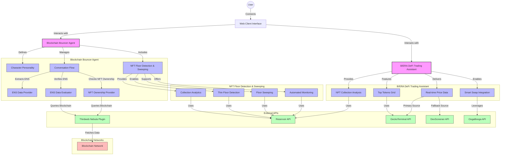

```mermaid
graph TB
    %% Main Components
    User((User))
    WebClient[Web Client Interface]
    BlockchainBouncer[Blockchain Bouncer Agent]
    BERA[B/ERA DeFi Trading Assistant]
    
    %% Blockchain Bouncer Components
    CharacterPersonality[Character Personality]
    ConversationFlow[Conversation Flow]
    ENSProvider[ENS Data Provider]
    ENSEvaluator[ENS Data Evaluator]
    NFTOwnershipProvider[NFT Ownership Provider]
    NebulaPlugin[Thirdweb Nebula Plugin]
    BlockchainNetwork[Blockchain Network]
    
    %% NFT Floor Detection Components
    NFTFloorDetection[NFT Floor Detection & Sweeping]
    CollectionAnalytics[Collection Analytics]
    ThinFloorDetection[Thin Floor Detection]
    FloorSweeping[Floor Sweeping]
    AutoMonitoring[Automated Monitoring]
    ReservoirAPI[Reservoir API]
    
    %% B/ERA Components
    TopTokensGrid[Top Tokens Grid]
    NFTCollectionAnalysis[NFT Collection Analysis]
    RealTimePriceData[Real-time Price Data]
    SmartSwapIntegration[Smart Swap Integration]
    GeckoTerminalAPI[GeckoTerminal API]
    DexScreenerAPI[DexScreener API]
    OogaBoogaAPI[OogaBooga API]
    
    %% Connections - User Flow
    User -->|Connects| WebClient
    WebClient -->|Interacts with| BlockchainBouncer
    WebClient -->|Interacts with| BERA
    
    %% Blockchain Bouncer Connections
    BlockchainBouncer -->|Defines| CharacterPersonality
    BlockchainBouncer -->|Manages| ConversationFlow
    ConversationFlow -->|Extracts ENS| ENSProvider
    ConversationFlow -->|Verifies ENS| ENSEvaluator
    ConversationFlow -->|Checks NFT Ownership| NFTOwnershipProvider
    ENSEvaluator -->|Queries Blockchain| NebulaPlugin
    NFTOwnershipProvider -->|Queries Blockchain| NebulaPlugin
    NebulaPlugin -->|Fetches Data| BlockchainNetwork
    
    %% NFT Floor Detection Connections
    BlockchainBouncer -->|Includes| NFTFloorDetection
    NFTFloorDetection -->|Provides| CollectionAnalytics
    NFTFloorDetection -->|Enables| ThinFloorDetection
    NFTFloorDetection -->|Supports| FloorSweeping
    NFTFloorDetection -->|Offers| AutoMonitoring
    CollectionAnalytics -->|Uses| ReservoirAPI
    ThinFloorDetection -->|Uses| ReservoirAPI
    FloorSweeping -->|Uses| ReservoirAPI
    AutoMonitoring -->|Uses| ReservoirAPI
    
    %% B/ERA Connections
    BERA -->|Features| TopTokensGrid
    BERA -->|Provides| NFTCollectionAnalysis
    BERA -->|Delivers| RealTimePriceData
    BERA -->|Enables| SmartSwapIntegration
    TopTokensGrid -->|Uses| GeckoTerminalAPI
    RealTimePriceData -->|Primary Source| GeckoTerminalAPI
    RealTimePriceData -->|Fallback Source| DexScreenerAPI
    SmartSwapIntegration -->|Leverages| OogaBoogaAPI
    NFTCollectionAnalysis -->|Uses| ReservoirAPI
    
    %% Subgraphs
    subgraph "Blockchain Bouncer Agent"
        CharacterPersonality
        ConversationFlow
        ENSProvider
        ENSEvaluator
        NFTOwnershipProvider
        NFTFloorDetection
    end
    
    subgraph "NFT Floor Detection & Sweeping"
        CollectionAnalytics
        ThinFloorDetection
        FloorSweeping
        AutoMonitoring
    end
    
    subgraph "B/ERA DeFi Trading Assistant"
        TopTokensGrid
        NFTCollectionAnalysis
        RealTimePriceData
        SmartSwapIntegration
    end
    
    subgraph "External APIs"
        NebulaPlugin
        ReservoirAPI
        GeckoTerminalAPI
        DexScreenerAPI
        OogaBoogaAPI
    end
    
    subgraph "Blockchain Networks"
        BlockchainNetwork
    end

    %% Styling
    classDef primary fill:#f9f,stroke:#333,stroke-width:2px;
    classDef secondary fill:#bbf,stroke:#333,stroke-width:1px;
    classDef external fill:#fbb,stroke:#333,stroke-width:1px;
    classDef api fill:#bfb,stroke:#333,stroke-width:1px;
    
    class BlockchainBouncer,BERA primary;
    class CharacterPersonality,ConversationFlow,ENSProvider,ENSEvaluator,NFTOwnershipProvider,NFTFloorDetection,TopTokensGrid,NFTCollectionAnalysis,RealTimePriceData,SmartSwapIntegration secondary;
    class CollectionAnalytics,ThinFloorDetection,FloorSweeping,AutoMonitoring secondary;
    class NebulaPlugin,ReservoirAPI,GeckoTerminalAPI,DexScreenerAPI,OogaBoogaAPI api;
    class BlockchainNetwork external;
``` 